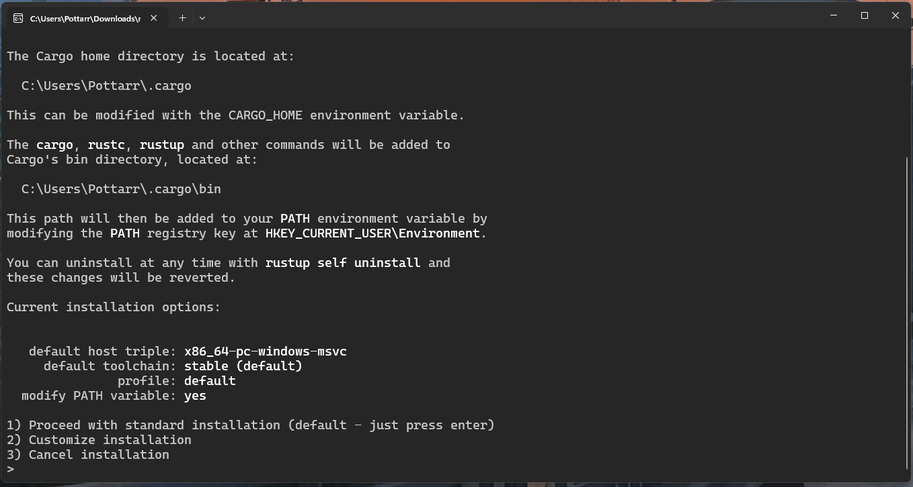

# Topics
- Installing Rust
  - Windows
  - MacOS and Linux
- Rust Compiler and Cargo
  - rustc (Rust compiler)
  - cargo (Rust packages manager)
  - rustc VS cargo
- Basic Syntax
  - print! and println!
  - Commenting Code
- Variables and Data Types
  - let Keyword
  - mut Keyword
  - Shadowing
  - Simple Data Types
    - Integers
    - Floating-point Numbers
    - Boolean
    - Char
- Operators
  - Operator Types (By number of operands)
    - Unary Operators
    - Binary Operators
  - Operator Types (By their use cases)
    - Arithmetic Operators
    - Comparison Operators
    - Logical Operators
    - Compound Assignment Operators
    - Parentheses
- Control Flow Keywords
  - if/else statements
  - Nested if statements
  - match statements
- Loops
  - Normal Loop
  - For Loop
  - While Loop

# Installing Rust

## For Windows
[Follow this link](https://www.rust-lang.org/tools/install) and download from the 64-bit version of the installer.

> [!NOTE]
> May need to install Visual Studio

After downloading the **rustup-init.exe** from the link above, open the executable (.exe) file, enter 1 into the terminal and submit. This process will download the automnatically install rust via Visual Studio and finish the installation. 




## For MacOS or Linux
```sh
curl --proto '=https' --tlsv1.2 -sSf https://sh.rustup.rs | sh
```

> [!IMPORTANT]
> Prerequisite: Need curl installed, you may ask TA for help.

### Understanding the command
Just to let you know, every time you get any bash command from the internet, MAKE SURE you understand the context of it!  

This command is the download command using `curl` with flag `--proto` to check for the link to be `https`, the flag `--tlsv1.2` is to force to use `TLS version 1.2+` and the flag `-sSf` in the end is to **silent when successfully installed and thow error when failed**.

# Rust Compiler and Cargo

Rust is a compiled programming language, therefore it needs a compiler.  

There are 2 ways to compile rust code.

## rustc (Rust Compiler)

`rustc` is mainly used in small project which has only one rust (.rs) file and does not rely on dependencies.  

To use `rustc`,

```sh
rustc your_program_name.rs -o your executable_file_name
```

> [!TIP]
> If you realize the name of the file, you can see that Rust programming language has its own convention about naming file. It is recommended to use `snake_case` for most of the element of your codes or programs.

It is optional to declare the flag `-o` (output name flag). If you do not declare it, the compiler will name the executable file after your program name.  

> [!IMPORTANT]
> For Windows, you need to have `.exe` after the executable files, while in MacOS and Linux, it is unnecessary. (On Windows, after the `-o` flag, it is unnecessary to enter `.exe` afte the executable file name, since the compiler can figure it out by itself)

## cargo (Rust packages manager)

`cargo` is mainly used in real-world project which has hierarchy of files and rely on dependencies. You can add or remove dependencies in the `cargo.toml` file. You can also create a documentation for your Rust project using cargo too.

To create a new Rust project using `cargo`,

```sh
cargo new your_project_name
```

> As you can see, cargo prefer `snake_case` to be the naming format of your project name too.

**DO NOT FORGET TO ENTER THE DIRECTORY BEFORE PROCEEDING OTHER COMMAND VIA CARGO**

```sh
cd your_project_name
```

To build the project as the execuatble file using `cargo`,

```sh
cargo build
```

To run the project code using `cargo`,

```sh
cargo run
```

To create the project's documentation using `cargo`,

```sh
cargo doc
```
To open the project's documentation using `cargo`,

```sh
cargo doc --open
```

## rustc VS cargo

| Use cases | rustc | cargo |
| ---------- | ----------- | ---------- |
| Project Size | One file | Project with hierarchy of files |
| Dependencies | Does not support | Can manage using `cargo.toml` |
| Documenting | No built-in for that | Can create it using `cargo doc` |

# Basic Syntax

## print!() and println!()

In Rust, we use print!() and println!() **macros** to show the output on the terminal.

> [!IMPORTANT]
> Macros are not Functions but we will not dive into it in this 2 days session.

Now, let's write our first program!

```rs
fn main() {
    println!("Hello, World!");
}
```

To explain what is going on, we need to know that Rust code will start executing only when it has got the main function somewhere in the code.  

Unlike C and C++, Rust main function can be anywhere in the code. It can above, under, or in the middle of other functions

> We will talk more about function in the following day session.

## Commenting Code

In rust we use double forward slashes `//` to comment code.

For example,  

```rs
fn main() {
    println!("Hello, World!");
    // println!("This won't be printed hehe");
}
```

The output should be  

```sh
Hello, World!
```

# Variable Types

# Operators

Like in mathematics, any expression has operators and operands. You will see an example from the next diagram.  

```sh
                    This is an operator
                             |
                             ∨
                           7 + 2
                           ∧   ∧
                           |   |
                    These are operands
```

## Operator Types (By number of operands)

In this 2 days session we will talk about 2 types of operators.

- Unary Operators
- Binary Operators

### Unary Operators

The unary operators are operators which need only 1 operand.

```rs
let negative_int = -2; // This is a negative sign operator.
let wrong = !true; // This is a logical negation operator.
```

### Binary Operators

The binary operators are operator which need 2 operands. This types of operators are the most commonly found in everyday life.

## Operator Types (By their use cases)

### Arithmetic Operators

In Rust, arithmetic operators are used to do the arithmetic calculation as like in normal mathematics.

```rs
fn main() {
    let negative = -5;
    let addition = 3 + 1;
    let subtraction = 1 - 3;
    let multiplication = 4 * 2;
    let division = 5 / 2;
    let modulo = 14 % 3;
    println!("Negative: {}", negative);
    println!("Addition: {}", addition);
    println!("Subtraction: {}", subtraction);
    println!("Multiplication: {}", multiplication);
    println!("Division: {}", division);
    println!("Modulo: {}", modulo);
}
```

The output should be  

```sh
Negative: -5
Addition: 4
Subtraction: -2
Multiplication: 8
Division: 2
Modulo: 2
```

> [!IMPORTANT]
> If you look carefully at the Division, you will see that the result has no decimal points. That is because the compiler assumes that the number being operated are 32-bit integer (i32).

### Comparison Operators

In Rust, comparison operators are used to compare values or expressions, and they return a boolean value (true or false).  

| Operator | Name                     | Description                                                             |
| -------- | ------------------------ | ----------------------------------------------------------------------- |
| `==`     | Equality                 | Returns `true` if both values are equal.                                |
| `!=`     | Inequality               | Returns `true` if the values are not equal.                             |
| `<`      | Less than                | Returns `true` if the left value is less than the right.                |
| `<=`     | Less than or equal to    | Returns `true` if the left value is less than or equal to the right.    |
| `>`      | Greater than             | Returns `true` if the left value is greater than the right.             |
| `>=`     | Greater than or equal to | Returns `true` if the left value is greater than or equal to the right. |

```rs
fn main() {
    let a = 5;
    let b = 10;

    println!("a == b: {}", a == b);
    println!("a != b: {}", a != b);
    println!("a < b: {}", a < b);
    println!("a <= b: {}", a <= b);
    println!("a > b: {}", a > b);
    println!("a >= b: {}", a >= b);
}
```

The output should be  

```sh
a == b: false
a != b: true
a < b: true
a <= b: true
a > b: false
a >= b: false
```

### Logical Operators

In Rust, logical operators are used to combine or invert boolean expressions. They're most commonly used in `if` statements and similar control flow constructs.

| Operator | Name | Description |
| ------- | ------- | ------- |
| `&&`     | Logical AND | Returns `true` only if **both** expressions are `true`. |
| `\|\|` | Logical OR | Returns `true` if **at least one** expression is `true`. |
| `!` | Logical NOT | Inverts the value: `true` becomes `false` and vice versa. |

```rs
fn main() {
    let a = true;
    let b = false;

    println!("a && b = {}", a && b);
    println!("a || b = {}", a || b);
    println!("!a = {}", !a);
}
```

The output should be  

```sh
a && b = false
a || b = true
!a = false
```

### Compound Assignment Operators

In most programming languages, we have compound assignment operators to shorten the expressions.  

| Operator | Description | Equivalent To |
| -------- | -------- | -------- |
| `+=` | Addition assignment | `a = a + b` |
| `-=` | Subtraction assignment | `a = a - b`   |
| `*=` | Multiplication assignment | `a = a * b` |
| `/=` | Division assignment | `a = a / b` |
| `%=` | Remainder assignment | `a = a % b` |

For example,  

```rs
fn main() {
    let mut num: i32 = 11;
    println!("The value of the number is {}", num);
    num += 2;
    println!("The value of the number is {}", num);
    num -= 3;
    println!("The value of the number is {}", num);
    num *= 4;
    println!("The value of the number is {}", num);
    num /= 5;
    println!("The value of the number is {}", num);
    num %= 6;
    println!("The value of the number is {}", num);
}
```
The output should be  

```sh
The value of the number is 11
The value of the number is 13
The value of the number is 10
The value of the number is 40
The value of the number is 8
The value of the number is 2
```

### Parentheses

# Control Flow Keywords

## If/else Statements

```rs
fn main() {
    if 1 + 1 == 2 {
        println!("1 + 1 = 2 is true");
    } else {
        println!("1 + 1 = 2 is false");
    }
}
```

The output should be  

```sh
1 + 1 = 2 is true
```

## Match Keyword

```rs
fn main() {
    let key_pressed = 'a';
    match key_pressed {
        'w' => println!("Move Forward"),
        'a' => println!("Move Left"),
        's' => println!("Move Backward"),
        'd' => println!("Move Right"),
        _ => println!("Invalid Input"),
    }
}
```

The output should be  

```sh
Move Left
```

# Loops

Rust has 3 types of loops.

## Normal Loop
The normal will execute the code in ts scope repeatly until i meets the condition and breaks inside the loop itself.  

For example, 

```rs
fn main() {
    let mut num: i32 = 10;
    loop {
        if num == 0 {
            println!("Happy New Year!!!");
            break;
        } else {
            print!("{} ", num);
            num -= 1;
        }
    }
}
```

The output should be  

```sh
10 9 8 7 6 5 4 3 2 1 Happy New Year!!!
```

## For Loop

This type of loop will loop through the iterator.

> [!NOTE]
> We will not cover the iterator in this 2 days session but it will be cover after midterm.  

For example,  

```rs
fn main() {
    for i in 1..3 {
        println!("Count is: {}", i);
    }
}
```

The output should be  

```sh
Count is: 1
Count is: 2
```

Wait there is no "Count is: 3"! Yes, the iterator in the for loop is exclusive at the ending boundary.  

To make the iterator inclusive we should at `=`.  

For example,  

```rs
fn main() {
    for i in 1..=3 {
        println!("Count is: {}", i);
    }
}
```

The output should be  

```sh
Count is: 1
Count is: 2
Count is: 3
```

Another example which will be helpful in the lab,  

```rs
fn main() {
    for i in 1..=5 {
        for _ in 1..=i {
            print!("*");
        }
        println!();
    }
}
```

The output should be  

```sh
*
**
***
****
*****
```

Another example,  

```rs
fn main() {
    for i in (1..=5).rev() {
        for _ in 1..=i {
            print!("*");
        }
        println!();
    }
}
```

The output should be  

```sh
*****
****
***
**
*
```

As you see, the iterator can be reverse using `.rev()` method.

> [!NOTE]
> Well now, what in the world is METHOD? We will not cover in this 2 days session but it will be taught in the OOP concept, hopefully before midterm or later.  

## While Loop

In Rust we normally declare a mutable variable or more to initialize the while loop.  

For example we can rewrite our old code as like this  

```rs
fn main() {
    let mut i: i32 = 1;
    let mut j: i32 = 1;

    while i <= 5 {
        while j <= i {
            print!("*");
            j += 1;
        }
        println!();
        i += 1;
        j = 1;
    }
}
```

The output should be  

```sh
*
**
***
****
*****
```

And also vice versa,  

```rs
fn main() {
    let mut i: i32 = 5;
    let mut j: i32 = 1;

    while i >= 1 {
        while j <= i {
            print!("*");
            j += 1;
        }
        println!();
        i -= 1;
        j = 1;
    }
}
```

The output should be  

```sh
*****
****
***
**
*
```

---
Lecturers:  
[Pottarr](https://github.com/Pottarr) (P'Potter)  
[Krakenlord5](https://github.com/Krakenlord5) (P'Tang)
